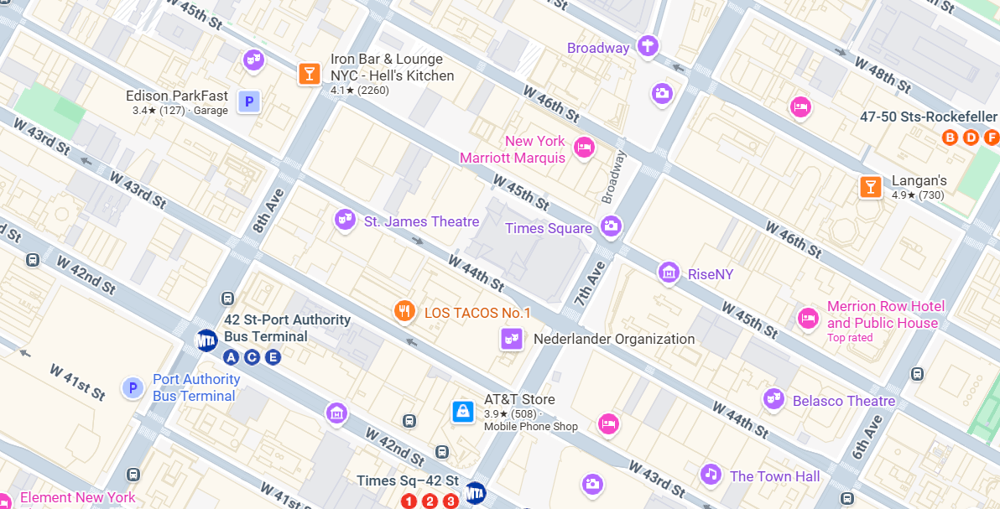
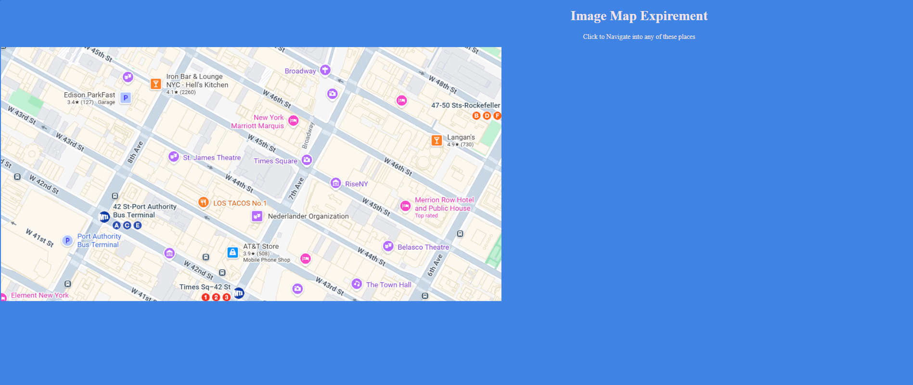

# Ex04 Places Around Me
## Date: 
4/10/2025
## AIM
To develop a website to display details about the places around my house.

## DESIGN STEPS

### STEP 1
Create a Django admin interface.

### STEP 2
Download your city map from Google.

### STEP 3
Using ```<map>``` tag name the map.

### STEP 4
Create clickable regions in the image using ```<area>``` tag.

### STEP 5
Write HTML programs for all the regions identified.

### STEP 6
Execute the programs and publish them.

## CODE

<!DOCTYPE html>
<html lang="en">
<head>
    <meta charset="UTF-8">
    <meta name="viewport" content="width=device-width, initial-scale=1.0">
    <title>Image Map Experiment</title>
    <style>
        body{
            background-color: #3F84E5;
        }
        
        h1,p{
            text-align: center;
            color: #F0E2E7;
        }
   
    </style>
</head>
<body>
    <h1>Image Map Expirement</h1>
    <p>Click to Navigate into any of these places</p>
    

    <map name="image-map">
        <area target="" alt="LOS TACOS No.1" title="LOS TACOS No.1" href="Los_tacos.html" coords="504,351,466,386" shape="rect">
        <area target="" alt="AT&amp;T Store" title="AT&amp;T Store" href="AT&T.html" coords="559,493,32" shape="circle">
        <area target="" alt="Belosco Theatre" title="Belosco Theatre" href="BeloscoTheatre.html" coords="922,486,19" shape="circle">
        <area target="" alt="Merrion Row Hotel and Public House" title="Merrion Row Hotel and Public House" href="" coords="947,378,958,360,994,374,972,400,944,386" shape="poly">
    </map>
    
</body>
</html>

<!DOCTYPE html>
<html lang="en">
<head>
    <meta charset="UTF-8">
    <meta name="viewport" content="width=device-width, initial-scale=1.0">
    <title>LAS TACOS</title>
    <style>
        body{
            background-color: #1E1E24;
        }
        h1{
            text-align: center;
            color: #FB9F89;
        }
        p{
            text-align: center;
            color: #FB9F89;
            font-size: 20px;
        }
        .image{
            display: block;
            margin-left: auto;
            margin-right: auto;
            width: 700px;


        }
        footer{
            text-align: center;
            color: #FB9F89;
            padding: 10px;
        }
    </style>
</head>
<body>
    <h1>LAS TACOS</h1>
    <p>Feel the taste of the real Tacos</p>
    
    <p>Address:229 W 43rd St, New York, NY 10036, United States</p>
    <p>Mall pit stop with standing tables serving authentic Mexican street food.</p>
    <footer>Thank you for Visiting us</footer>
</body>
</html>


<!DOCTYPE html>
<html lang="en">
<head>
    <meta charset="UTF-8">
    <meta name="viewport" content="width=device-width, initial-scale=1.0">
    <title>AT & T Store</title>
    <style>
        body{
            background-color: #1E1E24;
            font-family: 'Courier New', Courier, monospace;
        }
        h1,p,footer{
            text-align: center;
            color: #FB9F89;
            padding: 5px;
        }
        img{
            display: block;
            margin: auto;
            height: 500px;
        }
    </style>
</head>
<body>
    <h1>AT & T Mobile Store</h1>
    
    <p>There are 5,897 AT & T locations in the United States as of June 25, 2025. The state and territory with the most number of AT & T locations in the US is Texas, with 615 locations, which is about 10% of all AT & T locations in the US.</p>
    <p>Times Sq, New York, NY 10036, United States</p>
    <p>Phone Number : +12129211984</p>
    <footer>Thank you for Visiting us</footer>
</body>
</html>


<!DOCTYPE html>
<html lang="en">
<head>
    <meta charset="UTF-8">
    <meta name="viewport" content="width=device-width, initial-scale=1.0">
    <title>Belosco Theatre</title>
    <style>
        body{
            background-color: #1E1E24;
            font-family: 'Courier New', Courier, monospace;
        }
        h1,p,footer{
            text-align: center;
            color: #FB9F89;
            padding: 5px;
        }
        img{
            display: block;
            margin: auto;
            height: 800px;
        }
        a:hover{
            cursor: pointer;
            color: #FB9F89;
        }
    </style>
</head>
<body>
    <h1>Belosco Theatre</h1>
    <a href="https://tickets-center.com/"><p>Book Tickets</p></a>
    
    <p>Address</p>
    <p>111 W 44th St, New York, NY 10036, United States</p>
    <p>Phone number : +12122396200</p>
    <footer>Thank you for visiting us</footer>
</body>
</html>

## OUTPUT


 
 


## RESULT
The program for implementing image maps using HTML is executed successfully.
